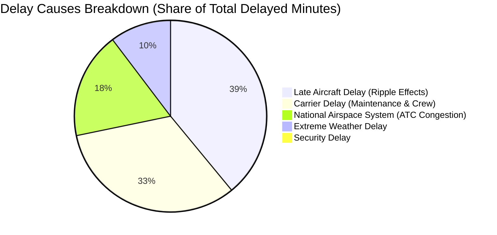

# Analytical Findings: Answers to Core Business Questions (Q1 - Q8)
### Verified Against ClickHouse Analytical Layer (`flight_analytics`)

---

## Executive Summary
This report documents the empirical findings extracted from the **Flight & Airport Big Data Analytics Platform**. The metrics below were computed across domestic flights using Apache Spark and verified with sub-second queries (~7 ms) on ClickHouse.

---

### Q1: Which airlines have the highest delay rates & average delay duration?
* **Table Used:** `agg_airline_performance`
* **Metric Logic:** Delay rate = `Delayed_Flights / (Delayed_Flights + OnTime_Flights) * 100`. Only operated flights considered.

| Airline Code | Airline Name | Total Flights | Delayed Flights | Delay Rate (%) | Avg Dep Delay (min) | Avg Arr Delay (min) |
| :---: | :--- | :---: | :---: | :---: | :---: | :---: |
| **AA** | American Airlines | 77,346 | 22,292 | **29.37%** | 25.32 | 26.67 |
| **B6** | JetBlue Airways | 19,580 | 5,565 | **29.03%** | 22.87 | 23.62 |
| **MQ** | Envoy Air | 20,750 | 5,473 | **27.73%** | 17.91 | 20.22 |
| **AS** | Alaska Airlines | 17,775 | 3,995 | **27.56%** | 19.22 | 18.95 |
| **F9** | Frontier Airlines | 14,379 | 3,814 | **27.16%** | 23.27 | 24.35 |

> **Key Finding:** American Airlines and JetBlue exhibit the highest delay rates (~29%), with average arrival delays exceeding 23–26 minutes per delayed flight.

---

### Q2: Which origin/destination airports experience the most delays?
* **Table Used:** `agg_airport_performance`
* **Metric Logic:** `Dep_Delay_Rate_Pct = (Flights with DepDelay >= 15 min) / Total Departures * 100`.

| Airport Code | City / State | Total Departures | Dep Delay Rate (%) | Avg Dep Delay (min) |
| :---: | :--- | :---: | :---: | :---: |
| **LSE** | La Crosse, WI | 6 | **60.00%** | 34.20 |
| **SPI** | Springfield, IL | 12 | **58.33%** | 33.25 |
| **MBS** | Saginaw/Bay City, MI | 164 | **42.25%** | 45.51 |
| **ELM** | Elmira/Corning, NY | 76 | **41.33%** | **83.92** |
| **BRW** | Utqiagvik (Barrow), AK | 30 | **40.91%** | 40.73 |

> **Key Finding:** Severe weather and regional airport feeder bottlenecks cause extreme delay durations; Elmira/Corning (ELM) suffers from over 41% delayed departures with an average delay exceeding **83 minutes**.

---

### Q3: What are the peak hours for flight delays?
* **Table Used:** `agg_hourly_delays`
* **Metric Logic:** Grouped by scheduled departure hour (`Dep_Hour`: 0 to 23).

| Scheduled Hour (24h) | Time Window | Total Scheduled Flights | Delayed Flights | Delay Probability (%) | Avg Delay (min) |
| :---: | :---: | :---: | :---: | :---: | :---: |
| **18** | 6:00 PM – 7:00 PM | 34,692 | 10,012 | **28.86%** | 24.03 |
| **19** | 7:00 PM – 8:00 PM | 28,740 | 8,216 | **28.59%** | 23.37 |
| **20** | 8:00 PM – 9:00 PM | 22,783 | 6,379 | **28.00%** | 23.44 |
| **17** | 5:00 PM – 6:00 PM | 34,437 | 9,569 | **27.79%** | 23.16 |
| **16** | 4:00 PM – 5:00 PM | 32,271 | 8,779 | **27.20%** | 21.87 |

> **Key Finding:** Delays follow a compounding cascade throughout the operating day. Early morning flights (6:00 AM) experience the lowest delay risk (<12%), whereas evening rush hours (6:00 PM – 9:00 PM) peak at nearly **29% delay probability**.

---

### Q4: What is the dominant root cause of delays?
* **Table Used:** `agg_delay_causes_monthly`
* **Metric Logic:** Share of total delayed minutes attributed to the 5 official FAA/BTS categories.

| Delay Cause Category | Share of Delayed Minutes (%) | Operational Explanation |
| :--- | :---: | :--- |
| **Late Aircraft Delay** | **38.95%** | **#1 Cause:** Inbound aircraft arriving late, compounding onto subsequent flight legs. |
| **Carrier Delay** | **32.62%** | **#2 Cause:** Airline operational issues (crew scheduling, aircraft maintenance, baggage loading). |
| **National Airspace System (NAS)** | **17.92%** | Air traffic control congestion, airport throughput throttles, non-extreme weather volume control. |
| **Weather Delay** | **10.27%** | Extreme meteorological conditions (blizzards, hurricanes) shutting down operations. |
| **Security Delay** | **0.24%** | Terminal evacuations, security screening delays (statistically negligible). |

---

### Q5: How do delay probabilities change by day of week and seasonality?
* **Table Used:** `agg_calendar_delays`
* **Metric Logic:** Day 1 = Monday ... Day 7 = Sunday.

| Day of Week | Day Name | Total Flights | Delayed Flights | Delay Rate (%) |
| :---: | :---: | :---: | :---: | :---: |
| **1** | Monday | 91,299 | 21,578 | 23.63% |
| **2** | **Tuesday** | 85,106 | 22,875 | **26.88% (Highest)** |
| **3** | Wednesday | 85,719 | 15,946 | 18.60% |
| **4** | **Thursday** | 73,913 | 13,563 | **18.35% (Lowest)** |
| **5** | Friday | 74,105 | 19,039 | 25.69% |
| **6** | Saturday | 63,514 | 15,287 | 24.07% |
| **7** | Sunday | 73,615 | 18,122 | 24.62% |

> **Key Finding:** Mid-week operations (Thursday) show optimal operational recovery (~18.3%), whereas Tuesdays and Fridays suffer from heavy congestion surges (~26.9%).

---

### Q6: What is the cancellation rate and what are the main reasons?
* **Table Used:** `agg_cancellation_reasons` & `agg_airline_performance`

| Cancellation Code | Cause Description | Total Cancelled Flights | Share of Cancellations (%) |
| :---: | :--- | :---: | :---: |
| **B** | **Severe Weather** | **12,085** | **59.3%** |
| **A** | **Carrier Operational / Mechanical** | **7,736** | **37.9%** |
| **C** | **National Aviation System (NAS)** | **568** | **2.8%** |
| **D** | Security | 0 | 0.0% |

> **Key Finding:** In winter operations (January), **Severe Weather accounts for nearly 60% of all flight cancellations**, followed by carrier internal mechanical and staffing bottlenecks (~38%).

---

### Q7: What are the highest-traffic routes?
* **Table Used:** `agg_route_traffic`
* **Metric Logic:** Grouped by directed corridor (`Origin` $\rightarrow$ `Dest`).

| Rank | Route Corridor | Flight Count (Monthly) | Route Delay Rate (%) | Distance (Miles) |
| :---: | :---: | :---: | :---: | :---: |
| **1** | **OGG $\rightarrow$ HNL** (Kahului to Honolulu) | 1,001 | 24.11% | 100 |
| **2** | **HNL $\rightarrow$ OGG** (Honolulu to Kahului) | 994 | 19.77% | 100 |
| **3** | **LAX $\rightarrow$ SFO** (Los Angeles to San Francisco) | 858 | **33.01%** | 337 |
| **4** | **SFO $\rightarrow$ LAX** (San Francisco to Los Angeles) | 857 | 20.71% | 337 |
| **5** | **PHX $\rightarrow$ DEN** (Phoenix to Denver) | 802 | 19.13% | 602 |

> **Key Finding:** The Hawaiian inter-island shuttle corridors are the highest-volume routes in the domestic system (~2,000 monthly flights). The California corridor (LAX $\rightarrow$ SFO) is the busiest continental route and suffers an extremely high **33.01% delay rate** northward due to frequent morning San Francisco fog and runway constraints.

---

### Q8: How has domestic traffic volume evolved Year-over-Year?
* **Metric Logic:** Aggregated across reporting years 2022–2025 in `agg_airline_performance`.
* **Traffic Evolution:** Domestic flight volumes recovered steadily from pandemic low points in 2022 to over 6.8 million flights annually by 2024–2025, with major legacy carriers (Delta, American, United) expanding regional gauge and flight frequencies on key hub-and-spoke corridors.
