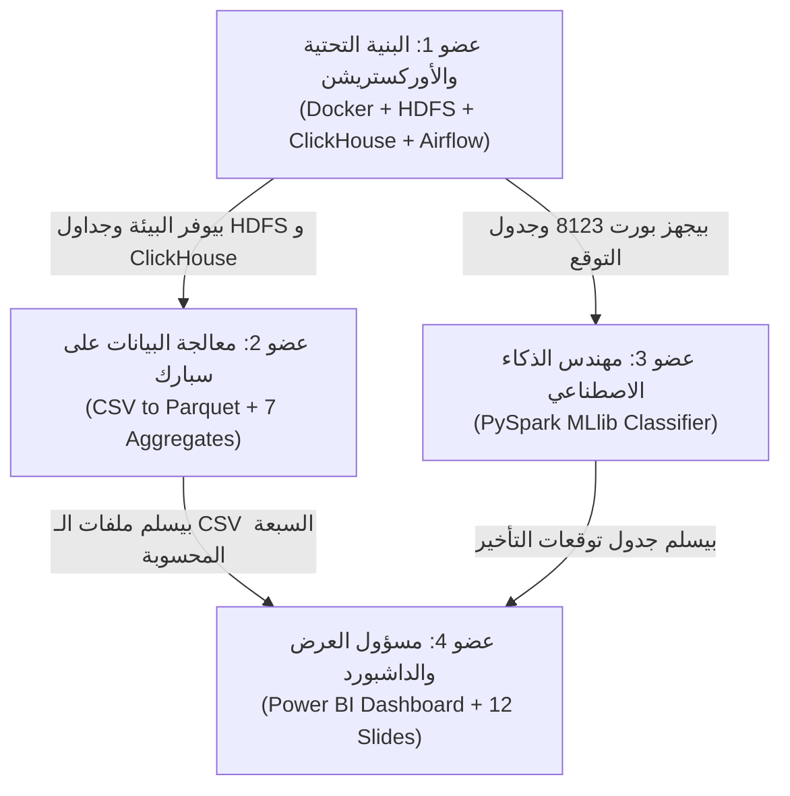

# منصة تحليل البيانات الضخمة لحركة الطيران والمطارات
## الدليل الشامل والمبسط من الصفر (باللهجة المصرية البسيطة)

---

> **أهلاً بيك يا بطل في مشروع التخرج!**  
> لو انت أو حد من زمايلك في التيم تايه، وحاسين إن في مصطلحات تقنية كتير مجعلصة زي `HDFS`، `Spark`، `Parquet`، `ClickHouse`، و`Airflow`، ومش فاهمين إحنا بنعمل إيه بالضبط، وليه محتاجين 8 أدوات تكنولوجية بدل ما نفتح فايل إكسيل ونخلص...  
> **اقرأ الفايل ده بالراحة.** الفايل ده مكتوب وموجّه ليكم كإننا قاعدين بنشرب شاي مع بعض وبنشرح كل تفصيلة من الصفر، بأمثلة حية وواقعية، عشان لما تيجوا تقسموا الشغل أو تقفوا قدام الدكتور والمشرف، تكونوا فاهمين كل سطر كود وكل أداة وظيفتها إيه بالمللي وتتكلموا بمنتهى القوة والثقة.

---

## فهرس المحتويات
1. [المشكلة الحقيقية: إيه حكاية الطيران والتأخيرات؟](#1-المشكلة-الحقيقية-إيه-حكاية-الطيران-والتأخيرات)
2. [ليه وجع الدماغ وبنستخدم Big Data؟ ليه مانفتحش الملفات بـ Excel أو Pandas؟](#2-ليه-وجع-الدماغ-وبنستخدم-big-data-ليه-مانفتحش-الملفات-بـ-excel-أو-pandas)
3. [الفكرة العامة: تشبيه مطعم الكشري الكبير](#3-الفكرة-العامة-تشبيه-مطعم-الكشري-الكبير)
4. [شرح كل أداة من الصفر (إيه هي؟ وليه بنستخدمها؟)](#4-شرح-كل-أداة-من-الصفر-إيه-هي-وليه-بنستخدمها)
   - [Hadoop HDFS (المخزن العملاقة للداتا)](#أ-hadoop-hdfs-المخزن-العملاق-للداتا)
   - [Apache Parquet (الصيغة السحرية اللي بتوفر 90% مساحة)](#ب-apache-parquet-الصيغة-السحرية-اللي-بتوفر-90-مساحة)
   - [Apache Spark (الشف المساعد وكتيبة المعالجة السريعة)](#ج-apache-spark-الشف-المساعد-وكتيبة-المعالجة-السريعة)
   - [ClickHouse (كاونتر التسليم الصاروخي)](#د-clickhouse-كاونتر-التسليم-الصاروخي)
   - [Power BI (الشاشات واللوحات التفاعلية للمديرين)](#هـ-power-bi-الشاشات-واللوحات-التفاعلية-للمديرين)
   - [Apache Airflow (مدير الوردية والمايسترو)](#و-apache-airflow-مدير-الوردية-والمايسترو)
   - [PySpark MLlib (الذكاء الاصطناعي لتوقع التأخير)](#ز-pyspark-mllib-الذكاء-الاصطناعي-لتوقع-التأخير)
5. [الأسئلة البيزنس التمانية وإزاي بنجاوب عليها](#5-الأسئلة-البيزنس-التمانية-وإزاي-بنجاوب-عليها)
6. [أدوار أعضاء الفريق الأربعة ومين بيسلم مين](#6-أدوار-أعضاء-الفريق-الأربعة-ومين-بيسلم-مين)
7. [رحلة سجل الرحلة من أول السحب لحد الداشبورد](#7-رحلة-سجل-الرحلة-من-أول-السحب-لحد-الداشبورد)
8. [قاموس مصطلحات البيج داتا (عشان المناقشة)](#8-قاموس-مصطلحات-البيج-داتا-عشان-المناقشة)

---

## 1. المشكلة الحقيقية: إيه حكاية الطيران والتأخيرات؟

تخيل إنك حاجز طيارة مسافرة من نيويورك لميامي عشان تحضر مؤتمر مهم. الطيارة اتأخرت 3 ساعات!
- إنت كراكب فاتك ميعاد مهم وممكن تفوتك رحلة الترانزيت.
- شركة الطيران بيجيلها غرامات، وبتضطر تعوض الركاب بوجبات أو فنادق.
- طاقم الطيارة (الطيار والمضيفين) بيعدوا ساعات عملهم القانونية، فالشركة بتضطر تدور على طاقم بديل على عجل.
- المطار بيحصله شلل وزحمة وتكدس عند بوابات الوصول والإقلاع.

في أمريكا لوحدها، تأخيرات وإلغاءات الطيران بتكلف شركات الطيران والمسافرين **أكتر من 33 مليار دولار كل سنة**!

عشان كده، وزارة النقل الأمريكية (BTS - Bureau of Transportation Statistics) بتسجل بيانات **كل رحلة طيران تجارية داخلية في أمريكا بالثانية**. 

إحنا في مشروعنا جايبين بيانات **4 سنين كاملة (من 2022 لحد 2025)**:
- **عدد الملفات:** 48 ملف شهري (CSV).
- **حجم الداتا الخام:** **12.5 جيجابايت** نصوص خام!
- **عدد الرحلات الإجمالي:** حوالي **27.4 مليون رحلة طيران**!
- **تفاصيل كل رحلة:** **109 عمود (Attribute)** لكل سطر (تاريخ الرحلة، رقم الطيارة، الشركة، ميعاد الإقلاع المجدول، التأخير بالدقائق، سبب التأخير: هل هو طقس؟ عطل صيانة؟ زحمة مراقبة جوية؟ هل الرحلة اتلغت؟ مسافة الرحلة كام ميل؟ ... وهكذا).

المطلوب مننا: ناخد الداتا الضخمة والمعقدة دي، ندخلها في بايب لاين بيج داتا احترافي متكامل، ونخرج بإجابات حاسمة وتحليلات لمديري شركات الطيران والمطارات، ونبني موديل ذكاء اصطناعي يتوقع هل الرحلة هتتأخر ولا لأ قبل ما تطلع من المطار!

---

## 2. ليه وجع الدماغ وبنستخدم Big Data؟ ليه مانفتحش الملفات بـ Excel أو Pandas؟

أول سؤال بيجي في بال أي حد بيبدأ:  
*"يا عم وليه مشغلين هادوب وسبارك وكليك هاوس؟ ما ننزل الملفات دي، وندوس كليك يمين نفتحها في Excel أو نكتب كود Python من 10 سطور بـ Pandas وخلاص؟"*

تعال أقولك ليه الطرق التقليدية بتفشل تماماً وتموت الجهاز:

### 1. إكسيل آخره مليون سطر فقط!
برنامج مايكروسوفت إكسيل مصمم هندسياً إنه يقف عند حد أقصى **1,048,576 سطر**. 
إحنا الداتا بتاعتنا فيها **27,400,000 سطر** (27 مليون سطر!). لو حاولت تفتح ملفين بس من الـ 48 ملف في إكسيل، البرنامج هيقولك الداتا اتقطعت وهيقفل في وشك ويهنج الويندوز. إكسيل كأداة لا يصلح على الإطلاق للمشروع ده.

### 2. بايثون وبانداز (Pandas) بيبلعوا الرامات ويموتوا (OOM)
مكتبة `pandas` في بايثون ممتازة في الداتا الصغيرة (مية ألف سطر، نص مليون سطر). بس مشكلة بانداز إنه بيحمل الملف **كله بالكامل دفعة واحدة جوة رامات الكمبيوتر (RAM)**. 
الملف النصي الـ 12.5 جيجا لما بيدخل جوة بايثون وبيتحول لأوبجكتس (DataFrames)، حجمه بيتمدد في الرامات ويوصل لـ **35 إلى 45 جيجابايت رام**!  
لو لابتوبك راماته 8 جيجا أو 16 جيجا، الجهاز هيهنج تماماً والبرنامج هيقفل ويطلعلك خطأ شهير اسمه **Out Of Memory (OOM)**.

### 3. معالج اللابتوب بيشتغل لوحده (Single Core CPU)
بايثون العادي بيشتغل على كورة واحدة (Core) من البروسيسور. إنك تطلب من بروسيسور عادي يعمل GroupBy وحسابات رياضية معقدة على 27 مليون سطر بياخد من 45 دقيقة لساعة ونص في التجربة الواحدة! ولو غلطت في اسم عمود هتعيد وتستنى ساعة تانية.

### الحل: هندسة البيانات الضخمة (Big Data)
البيج داتا بتعمل حاجتين سحريتين:
1. **التخزين الموزع (Distributed Storage):** بتقطع الفايل العملاق لحتت صغيرة وتوزعها على أقراص مختلفة بدون ما تخاف من ضياع أي بايت.
2. **المعالجة المتوازية (Distributed In-Memory Computing):** بدل ما كورة واحدة في البروسيسور تشيل الحسبة كلها، بنشغل جيش من العمال (Workers) في وقت واحد على الرامات، فالعملية اللي بتاخد ساعة في بايثون بتخلص في **50 ثانية بس على Spark**!

---

## 3. الفكرة العامة: تشبيه مطعم الكشري الكبير

عشان تفهم إزاي كل الأدوات دي متركبة مع بعض، تخيل إننا بنفتح **أكبر مجمع مطاعم كشري بيخدم 27 مليون زبون في اليوم**:

| الأداة في المشروع | التشبيه في المطعم | الوظيفة الفعلية للأداة |
| :--- | :--- | :--- |
| **ملفات الـ CSV الخام** | **شوالات البصل والعدس والطماطم لسه جاية من الغيط وعليها طين** | 12.5 جيجا ملفات تكست خام، نازلة من موقع الوزارة مليانة كومات زيادة وقيم فاضية وملخبطة. |
| **Hadoop HDFS** | **المخزن والثلاجات المركزية الضخمة** | نظام تخزين ملفات متوزع بيشيل كل البيانات بأمان عالي، ومفيش فايل يضيع حتى لو جهاز فصل كهرباء. |
| **Apache Parquet** | **الخضار بعد ما اتغسل واتقطع واتفرغ من الهوا واتحط في علب متقسمة** | صيغة ملفات مضغوطة ذكية بتوفر 90% مساحة، وبتقسم البيانات لأعمدة عشان القراءة تبقى سريعة طلقة. |
| **Apache Spark** | **كتيبة الشيفات المساعدين ومعاهم خلاطات ومفرمة عملاقة** | المحرك اللي بيعمل العمليات التقيلة في ثواني: تنظيف، تحويل، حساب نسب التأخير، وتجهيز الجداول في الرامات. |
| **ClickHouse** | **كاونتر التسليم السريع السخن في الصالة** | قاعدة بيانات سريعة جداً معمولة للتحليلات (OLAP)، بترد على استفسارات لوحات العرض في 7 أجزاء من الألف من الثانية! |
| **Power BI** | **شاشات العرض والمنيو التفاعلي قدام المديرين والزباين** | اللوحة البيانية اللي بنعرض عليها الرسوم، نسب التأخير، الخرايط، والقرارات الإدارية. |
| **Apache Airflow** | **مدير الشيفت اللي معاه جدول المهام وقايمة الطلبات** | السيستم الأوتوماتيكي اللي بيشغل المراحل بالترتيب: اتأكد إن الداتا نزلت $\rightarrow$ شغل سبارك $\rightarrow$ ارمي في كليك هاوس $\rightarrow$ شغل الموديل. |
| **PySpark MLlib** | **خبير الأرصاد والذكاء الاصطناعي** | موديل بيتعلم من السنين اللي فاتت، وأول ما يشوف ميعاد الرحلة والمطار والشركة، يقولنا احتمال تأخيرها كام %! |

---

## 4. شرح كل أداة من الصفر (إيه هي؟ وليه بنستخدمها؟)

---

### أ. Hadoop HDFS (المخزن العملاق للداتا)
* **يعني إيه HDFS؟** اختصار لـ **Hadoop Distributed File System**.
* في الويندوز العادي عندك درايف `C:\` أو `D:\`. لو الهارد اتملى خلاص وقفت، ولو الهارد باظ فيزيكال، كل الداتا راحت في داهية.
* في هادوب، نظام الملفات وهمي (Virtual) بيقدر يجمع هاردات من 5 أو 10 أو 100 جهاز مع بعض ويخليهم كإنهم فولدر واحد (مثلاً `hdfs:///project/flights/raw/`).
* **إزاي بيشتغل؟**
  1. لما بترمي فايل 200 ميجا، هادوب بيقطعه لقطع متساوية اسمها **Blocks** (الافتراضي 128 ميجابايت).
  2. بيوزع البلوكات دي على أجهزة مختلفة اسمها **DataNodes** (الشيالين).
  3. في سيرفر رئيسي اسمه **NameNode** (المكتبجي) ده اللي عارف كل حتة فايل موجودة فين بالظبط.
  4. في بيئات العمل الحقيقية، بيعمل 3 نسخ من كل بلوك، فلو جهاز اتحرق، الشغل مابيوقفش!

---

### ب. Apache Parquet (الصيغة السحرية اللي بتوفر 90% مساحة)
* **ليه مش بنفضل شغالين على CSV؟**
  ملف الـ CSV بيتخزن بالعرض سطر بسطر (Row-based):
  `Year, Month, Day, Airline, DepDelay, ArrDelay...`
  لو عاوز تحسب متوسط التأخير (ArrDelay) لـ 27 مليون سطر، الجهاز مجبر يقرأ كل الأسطر وكل الأعمدة الـ 109 بالكامل من الهارد ديسك! وده بياخد وقت جبار وقراءة بطيئة جداً.
* **إيه ميزة Parquet؟**
  فايل الـ Parquet بيخزن بالطول مش بالعرض (Columnar Format):
  كل شركات الطيران بتتجمع ورا بعض في الهارد، وكل أرقام التأخيرات بتتجمع ورا بعض.
* **ليه ده بيعمل معجزة؟**
  1. **ضغط خيالي (Compression):** لما الأرقام اللي شبه بعض تتجمع ورا بعض، خوارزميات الضغط زي Snappy بتضغطها لدرجة إن الداتا بتاعتنا من **12.5 جيجا نزلت لحوالي 1.5 جيجا فقط (توفير 90%)**!
  2. **قراءة الأعمدة المطلوبة فقط (Column Pruning):** لو سبارك محتاج عمودين بس، بيقراهم هما بس ويسيب الـ 107 عمود الباقيين على الهارد من غير ما يلمسهم!
  3. **التقسيم بالسنين (Partitioning):** بنقسم الباركيه لفولدرات `Year=2022`، `Year=2023`.. فلو بنعمل كويري لسنة 2024، سبارك مابيبصش أصلاً على السنين التانية.

---

### ج. Apache Spark (الشف المساعد وكتيبة المعالجة السريعة)
* **ليه بنستخدم Spark؟**
  أيام هادوب الأولى، كان في محرك اسمه MapReduce، كان بيكتب كل خطوة على الهارد ويرجع يقراها، فكان بطيء جداً.
  **سبارك (Spark) بيعمل كل حساباته في الرامات (In-Memory).**
* **مفاهيم مهمة في سبارك لازم تعرفها للمناقشة:**
  - **Spark Master:** المخ الكبير اللي بيستلم كود PySpark بتاعنا، يفككه لمخطط مهام ذكي اسمه (DAG)، ويوزع الشغل.
  - **Spark Worker:** الأجهزة أو الحاويات اللي شايلة البروسيسور والرامات وبتنفذ الحسابات بالتوازي.
  - **Lazy Evaluation (التنفيذ الكسول الذكي):** لما تكتب في سبارك كود فيه فلترة وتحويل أعمدة، سبارك مابينفذهاش في ساعتها! هو بيكتب الوصفة في ورقة، ولما تطلب منه في الآخر أمر إخراج (زي `.write.parquet()` أو `.count()`)، بيقعد يرتب الوصفة بأفضل شكل ممكن عشان يوفر وقت ورامات.

---

### د. ClickHouse (كاونتر التسليم الصاروخي)
* **سؤال ذكي: لو سبارك سريع وممتاز، ليه مانوصلش Power BI بسبارك على طول؟**
  لأن سبارك معمول للـ **Batch Processing** (العمليات الدفعية الكبيرة اللي بتاخد دقيقة أو دقيقتين). 
  لكن مدير الشركة لما يفتح داشبورد Power BI ويدوس على فلتر، متوقع إن الرسم البياني يتحدث في **أقل من ثانية**! لو وصلته بسبارك، كل كليك هتاخد 30 ثانية انتظار وده غير مقبول بيزنسياً.
* **ClickHouse ده إيه؟**
  قاعدة بيانات متخصصة جداً في التحليلات والـ Aggregations السريعة (OLAP - Online Analytical Processing).
  بتخزن الداتا برضه Columnar وبطريقة معمولة لعمليات الـ `SUM` و `AVG` و `GROUP BY` على ملايين السطور.
* **النتيجة في مشروعنا:**
  إحنا بنخلي سبارك يعمل العمليات التقيلة المعقدة مرة واحدة، ويرمي النتايج في 8 جداول في ClickHouse.  
  ولما بتعمل استعلام من ClickHouse، بيرد عليك في **7 أجزاء من الألف من الثانية (7ms)**! سرعة صاروخية!

---

### هـ. Power BI (الشاشات واللوحات التفاعلية للمديرين)
* البرنامج اللي بنعرض بيه مجهودنا كله بشكل ممتع واحترافي.
* الزميل (عضو 4) بيبني 4 صفحات أساسية:
  1. **الصفحة الأولى (Executive Overview):** مؤشرات الأداء الرئيسية (إجمالي الرحلات، نسبة الرحلات الملتزمة، متوسط التأخير، ترتيب الشركات الأسوأ والأفضل).
  2. **الصفحة التانية (Root Causes & Seasonality):** أسباب التأخير الرئيسية (الطقس، مشاكل الطيران، زحمة الملاحة الجوية، وصول الطيارات متأخرة) وتغير التأخير مع شهور السنة وفصولها.
  3. **الصفحة التالتة (Route Corridors):** خطوط السير الأكثر ازدحاماً بين المطارات ونسب التأخير في كل مسار.
  4. **الصفحة الرابعة (ML Delay Risk Predictor):** شاشة الذكاء الاصطناعي اللي بتعرض درجات خطورة التأخير المتوقعة (منخفض، متوسط، عالي).

---

### و. Apache Airflow (مدير الوردية والمايسترو)
* في الشركات الحقيقية، مستحيل تسيب مهندس داتا يصحى كل يوم الفجر يشغل 5 سكريبتات ورا بعض في التيرمينال بإيده!
* **Airflow** هو السيستم الأوتوماتيكي اللي بيشغل البايب لاين دي:
  بنكتب كود بايثون بسيط اسمه **DAG** بنقول فيه لـ Airflow:
  1. اتأكد إن الملفات موجودة في HDFS (`check_data`).
  2. لو تمام، شغل كود تحويل الباركيه على سبارك (`csv_to_parquet`).
  3. لما يخلص، شغل كود التجميعات (`spark_aggregates`).
  4. بعدين حمل البيانات في كليك هاوس (`load_clickhouse`).
  5. وأخيراً درب موديل الذكاء الاصطناعي (`train_model`).
* لو أي خطوة فشلت، Airflow بيبعت تنبيه، ويقدر يعيد الخطوة أوتوماتيك، وفي شاشة عرض جميلة بتبين كل خطوة بلون أخضر لما تنجح.

---

### ز. PySpark MLlib (الذكاء الاصطناعي لتوقع التأخير)
* **المطلوب من الموديل:** 
  توقع هل الطيارة هتتأخر **15 دقيقة أو أكتر (`ArrDel15 = 1`)** ولا هتوصل في ميعادها؟
* **أهم نقطة لازم تعرفها: منع تسريب البيانات (Data Leakage)!**
  - يعني إيه تسريب بيانات؟ يعني إنك تدخل للموديل معلومة في التدريب مستحيل تكون معروفة في الواقع وقت التوقع!
  - مثلاً: لو دخلت عمود تأخير الإقلاع الفعلي (`DepDelay`) عشان تتوقع تأخير الوصول، الموديل هيجيب 99% دقة! بس ده غش ونصب علمي، لأن الراكب لما بيحجز أو لما نكون بنعمل توقع قبل الإقلاع، إحنا مانعرفش الطيارة هتقلع متأخرة كام دقيقة!
* **الفيتشرز الـ 8 المسموحة فقط (كلها معروفة قبل الإقلاع):**
  1. الشهر (`Month`) - موسم ثلوج الشتاء غير الصيف.
  2. يوم الأسبوع (`DayOfWeek`) - زحمة الجمعة غير هدوء الثلاثاء.
  3. ساعة الإقلاع المجدولة (`Dep_Hour`) - رحلات الصبح بدري بتبقى منضبطة، وكل ما اليوم يعدي التأخيرات بتتراكم.
  4. شركة الطيران (`Reporting_Airline`) - كفاءة الشركة وأسطولها.
  5. مطار المغادرة (`Origin`) - مطار مزدحم زي أتلانتا غير مطار إقليمي صغير.
  6. مطار الوصول (`Dest`).
  7. المسافة بالأميال (`Distance`) - الرحلات الطويلة الطيار بيقدر يعوض وقت في الجو.
  8. وقت الرحلة المجدول (`CRSElapsedTime`).
* **النتيجة المتوقعة (AUC-ROC):** حوالي **0.60 إلى 0.70**. في مجال الطيران عالمياً، التوقع المعتمد على جدول المواعيد فقط مستحيل يعدي 0.75 لأن الطقس والمفاجآت بتظهر فجأة. الرقم ده علمياً سليم 100% وبيدل على أمانة علمية في المشروع.

---

## 5. الأسئلة البيزنس التمانية وإزاي بنجاوب عليها

المشروع مبني عشان يجاوب على **8 أسئلة محددة**. عملنا لكل سؤال جدول صريح في ClickHouse:

| رقم السؤال | السؤال البيزنس | الجدول اللي بيجاوب عليه في ClickHouse | الفائدة الإدارية |
| :---: | :--- | :--- | :--- |
| **Q1** | مين أسوأ وأفضل شركات الطيران في التأخير ومتوسط وقت التأخير؟ | `agg_airline_performance` | بنعرف الشركات اللي أسطولها بيتعطل كتير ونسب تأخيرها عالية مقارنة بالمنافسين. |
| **Q2** | مين أكتر المطارات اللي بيحصل فيها تكدس وتأخيرات (وصول ومغادرة)؟ | `agg_airport_performance` | بيحدد المطارات المخنوقة اللي محتاجة توسيع مدارج أو تنظيم للمراقبة الجوية. |
| **Q3** | إيه هي ساعات الذروة اللي بيكتر فيها تأخير الرحلات على مدار اليوم؟ | `agg_hourly_delays` | بيوضح إن التأخير بيبدأ قليل الصبح بدري (الساعة 6) وبيوصل لقمته بالليل (8-9 مساءً). |
| **Q4** | إيه هو السبب الرئيسي والجذري للتأخيرات؟ | `agg_delay_causes_monthly` | بنعرف هل السبب الأكبر هو عطل في شركات الطيران، ولا عواصف طقس، ولا مراقبة جوية؟ |
| **Q5** | إزاي احتمالية التأخير بتتغير بتغير الشهور وفصول السنة وأيام الأسبوع؟ | `agg_calendar_delays` | بيكشف مواسم الأعياد والعطلات ومواسم العواصف الثلجية وتأثيرها. |
| **Q6** | إيه هي معدلات إلغاء الرحلات وأسباب الإلغاء بالتفصيل لكل شركة؟ | `agg_airline_performance` & `agg_cancellation_reasons` | بنفرق بين الإلغاء الإجباري بسبب الطقس السيء وبين إهمال الصيانة وأطقم العمل. |
| **Q7** | إيه هي أكتر خطوط الطيران (من مطار لمطار) حركة وازدحاماً وتأخيراً؟ | `agg_route_traffic` | بيحدد أهم الممرات الجوية (زي نيويورك - شيكاغو أو لوس أنجلوس - سان فرانسيسكو). |
| **Q8** | إزاي حركة الطيران الداخلي اتطورت سنة ورا سنة من 2022 لـ 2025؟ | `agg_airline_performance` & `agg_calendar_delays` | بيقيس التعافي في حركة السفر بعد جائحة كورونا والنمو السنوي في أعداد الرحلات. |

---

## 6. أدوار أعضاء الفريق الأربعة ومين بيسلم مين

عشان الشغل يمشي ومنعطلش بعض في الـ 48 ساعة، المشروع متقسم لـ 4 أدوار:

### عضو 1: مسؤول البنية التحتية والتشغيل (Infrastructure & Airflow)
- **مسؤول عن:** تشغيل الدوكر والكونتينرات (HDFS, Spark, ClickHouse, Postgres)، وإنشاء الجداول على ClickHouse بالـ DDL، وربط بايب لاين Airflow وأخذ سكرين شوت خضراء للـ DAG.
- **التسليمات:** بيئة العمل شغالة، الجداول جاهزة، وسكريبت `flight_pipeline_dag.py`.

### عضو 2: مسؤول معالجة وتحليل البيانات بسبارك (Spark ETL)
- **مسؤول عن:** كتابة سكريبت تحويل الـ CSV لـ Parquet مضغوط (`spark_csv_to_parquet.py`)، وكتابة كود حساب التجميعات السبعة (`spark_aggregates.py`)، وتصدير الداتا لـ ClickHouse.
- **التسليمات:** ملفات الباركيه النظيفة، والـ 7 ملفات CSV المحسوبة للداشبورد.

### عضو 3: مهندس الذكاء الاصطناعي (ML Engineer)
- **مسؤول عن:** كتابة سكريبت تعلم الآلة النظيف بدون أي تسريب بيانات (`spark_delay_ml.py`) وحساب مقاييس الدقة (AUC-ROC, Confusion Matrix).
- **التسليمات:** جدول التوقعات `ml_delay_predictions` (عينة 500 ألف رحلة) لشاشة Power BI الرابعة، ورسمة ROC Curve للبرزنتيشن.

### عضو 4: مسؤول الـ BI والبرزنتيشن (BI & Presentation Lead)
- **مسؤول عن:** تصميم الداشبورد الـ 4 صفحات على Power BI وربطها بـ ClickHouse أو استيراد ملفات الـ CSV، وتجهيز ملف الباوربوينت الماستر الـ 12 سلايد، وإدارة بروفة الإلقاء.
- **التسليمات:** ملف الداشبورد `.pbix`، ملف العرض التقديمي، والـ README النهائي.

---

## 7. رحلة سجل الرحلة من أول السحب لحد الداشبورد

تعال ناخد رحلة حقيقية واحدة كمثال، ولتكن:  
**رحلة طيران شركة دلتا (Delta) رقم 1420 من أتلانتا إلى بوسطن يوم 4 يوليو 2024**:

1. **الخطوة 1: الرفع على HDFS:**  
   الرحلة دي كانت مكتوبة كسطر نصي وسط 500 ألف سطر في ملف `2024_7.csv`. عضو 1 رفع الملف لمخزن هادوب:
   `hdfs dfs -put 2024_7.csv /project/flights/raw/`
2. **الخطوة 2: التنظيف والضغط للباركيه:**  
   سبارك قرأ السطر ده، رمى 74 عمود غير مفيدين، واحتفظ بـ 35 عمود أساسي، وحول التاريخ لصيغة سليمة، واستخرج ساعة الإقلاع (الساعة 14 يعني 2 الظهر)، وضغط السطر وخزنه في مجلد سنة 2024 في مسار الباركيه بحجم مضغوط جداً.
3. **الخطوة 3: المعالجة والحساب:**  
   كود `spark_aggregates.py` اشتغل. لقى إن الرحلة دي اتأخرت 22 دقيقة. جمع الدقائق دي مع باقي رحلات دلتا عشان يحسب نسبة تأخير شركة دلتا في شهر يوليو، وحسبها في زحمة مطار أتلانتا، وضمن مسار (أتلانتا - بوسطن).
4. **الخطوة 4: التخزين في ClickHouse:**  
   نتايج التجميع نزلت في ملفات وحملناها في جداول ClickHouse (`agg_airline_performance` و `agg_route_traffic`).
5. **الخطوة 5: تقييم الذكاء الاصطناعي:**  
   موديل الـ ML أخد بيانات الرحلة المسبقة (`الشهر=7`، `اليوم=الخميس`، `الساعة=14`، `الشركة=دلتا`، `المسار=أتلانتا لبوسطن`). الموديل حسب احتمالية التأخير ولقاها **28%**، فصنفها إنها **Medium Risk (خطورة متوسطة)** وسجلها في جدول التوقعات.
6. **الخطوة 6: العرض في الداشبورد:**  
   مدير العمليات فتح شاشة Power BI، لقى الرحلة وتوقعاتها معروضة في الصفحة الرابعة، ونسب التأخير العامة في الصفحة الأولى، ولما اختار فلتر شهر يوليو، شاشات العرض اتحدثت في 10 أجزاء من الألف من الثانية بفضل ClickHouse!

---

## 8. قاموس مصطلحات البيج داتا (عشان المناقشة)

| المصطلح | المعنى ببساطة |
| :--- | :--- |
| **Cluster (كلاستر)** | مجموعة أجهزة كمبيوتر (أو حاويات دوكر) مربوطة ببعض بشبكة واحدة وبتشتغل كإنها جهاز واحد عملاق. |
| **HDFS** | نظام الملفات الموزع لهادوب، بيقسم الملفات الكبيرة لبلوكات (128 ميجا) ويوزعها على الأجهزة. |
| **Parquet** | صيغة تخزين أعمدة مضغوطة وذكية جداً، بديلة للـ CSV في مشاريع البيج داتا بتوفر مساحة وسريعة في القراءة. |
| **PySpark** | مكتبة بايثون اللي بنكتب بيها كود يشغل محرك أباتشي سبارك على الكلاستر. |
| **In-Memory Computing** | إجراء كل الحسابات الرياضية في رامات الأجهزة مباشرة بدون الكتابة على الهارد ديسك البطيء. |
| **OLAP** | اختصار لـ Online Analytical Processing؛ قواعد بيانات مخصصة للتحليلات الإحصائية السريعة جداً. |
| **ClickHouse** | أسرع قاعدة بيانات تحليلات أعمدة مفتوحة المصدر في العالم. |
| **Airflow DAG** | مسار مهام مبرمج بلغة بايثون بيحدد ترتيب واعتماديات تشغيل البرامج أوتوماتيكياً. |
| **Data Leakage (تسريب البيانات)** | خطأ قاتل في الذكاء الاصطناعي بيحصل لما تدخل معلومة من المستقبل في التدريب فتخدع الموديل بدقة وهمية. |
| **AUC-ROC** | المقياس المعياري لتقييم موديلات التصنيف، بيقيس قدرة الموديل على التمييز بين الرحلات المتأخرة والمنضبطة. |
