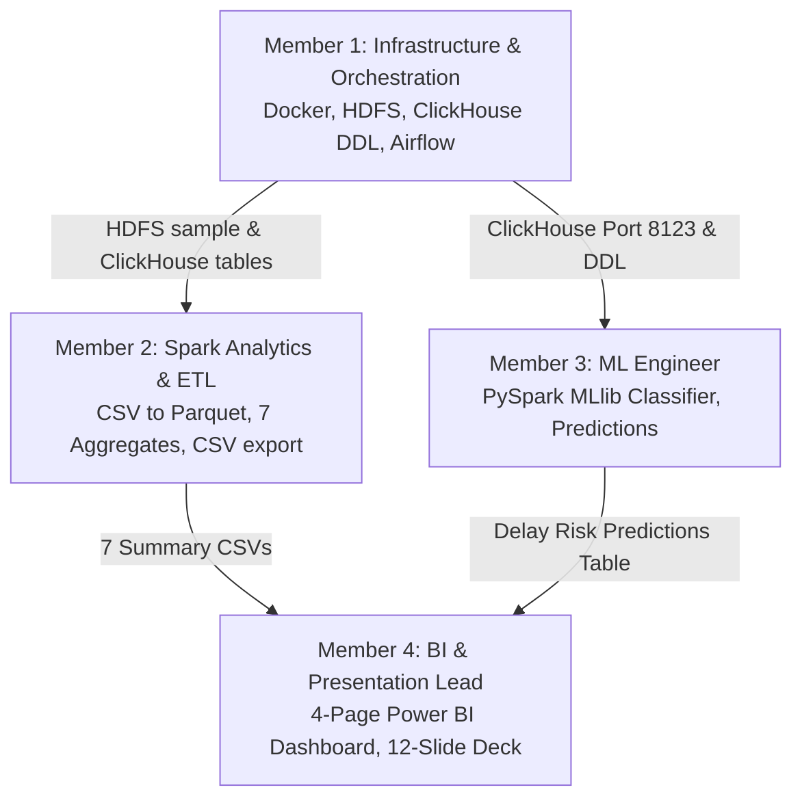

# Flight & Airport Big Data Analytics Platform
## The Complete "From Scratch" Plain-English Guide

---

> **Welcome to the Project Guide!**  
> If you are reading this, you might be wondering: *What on earth are we building? What is Hadoop, Spark, or ClickHouse? Why do we need 8 different tools instead of just opening an Excel file or writing a Python script?*  
> 
> Don't worry! This guide assumes **zero prior big data knowledge**. It explains the entire project from first principles using intuitive real-world analogies, step-by-step breakdowns, and practical explanations. By the time you finish reading, you and your teammates will understand every single moving part of our graduation project and will be ready to discuss it with total confidence.

---

## Table of Contents
1. [The Real-World Problem: Why Flight Delays?](#1-the-real-world-problem-why-flight-delays)
2. [Why "Big Data"? Why Can't We Just Use Excel or Pandas?](#2-why-big-data-why-cant-we-just-use-excel-or-pandas)
3. [The Big Picture: The Restaurant Kitchen Analogy](#3-the-big-picture-the-restaurant-kitchen-analogy)
4. [The Tech Stack: Every Tool Explained from Scratch](#4-the-tech-stack-every-tool-explained-from-scratch)
   - [Hadoop HDFS (The Cold Storage Warehouse)](#a-hadoop-hdfs-the-distributed-storage-warehouse)
   - [Apache Parquet (The Space-Saving File Format)](#b-apache-parquet-the-space-saving-columnar-format)
   - [Apache Spark (The Supercharged In-Memory Engine)](#c-apache-spark-the-supercharged-compute-engine)
   - [ClickHouse (The Sub-Second Analytical Serving Layer)](#d-clickhouse-the-lightning-fast-olap-database)
   - [Power BI (The Executive Dashboard)](#e-power-bi-the-interactive-executive-dashboard)
   - [Apache Airflow (The Master Kitchen Manager)](#f-apache-airflow-the-pipeline-orchestrator)
   - [PySpark MLlib (The AI Delay Predictor)](#g-pyspark-mllib-the-predictive-ai-model)
5. [The 8 Business Questions We Are Answering](#5-the-8-business-questions-we-are-answering)
6. [The 4 Team Member Roles & Handoffs](#6-the-4-team-member-roles--handoffs)
7. [Step-by-Step Data Journey (Life of a Flight Record)](#7-step-by-step-data-journey-life-of-a-flight-record)
8. [Glossary of Big Data Jargon](#8-glossary-of-big-data-jargon)

---

## 1. The Real-World Problem: Why Flight Delays?

Imagine you are booking a flight from New York (JFK) to Los Angeles (LAX). If your flight is delayed by 3 hours:
- You miss your connecting flight.
- The airline has to rebook you, pay for meals, and sometimes pay hotel vouchers.
- The flight crew reaches their legal maximum working hours, requiring a backup crew.
- The airport suffers congestion at the departure and arrival gates.

In the United States alone, flight delays cost airlines and passengers **over $33 billion every single year**. 

The **U.S. Bureau of Transportation Statistics (BTS)** tracks every single commercial domestic flight in America. Our project analyzes **4 complete years of this data (2022 to 2025)**:
- **Total volume:** 48 monthly CSV files.
- **Total size:** **12.5 Gigabytes** of raw text.
- **Total flights:** Approximately **27.4 Million flights**.
- **Attributes per flight:** **109 columns** (flight date, tail number, airline, departure time, delay minutes, weather delays, cancellation reasons, elapsed airtime, distance, etc.).

Our mission is to take this massive, chaotic ocean of flight records, process it through an industrial-grade Big Data pipeline, and deliver clear, actionable answers to airline executives, airport operators, and passengers.

---

## 2. Why "Big Data"? Why Can't We Just Use Excel or Pandas?

A common question beginners ask is:  
*"Why don't we just download the files, double-click to open them in Excel, or write a quick 10-line Python script using Pandas?"*

Here is why that fails completely:

### 1. Microsoft Excel Hard Limit
Microsoft Excel has a strict architectural limit of **1,048,576 rows**. 
Our dataset contains **27,400,000 rows**. If you try to open even two months of data in Excel, it will truncate the data and crash your computer. Excel physically cannot handle this volume.

### 2. The Python Pandas Memory Bottleneck
Python’s `pandas` library is wonderful for small projects, but Pandas loads the **entire dataset into your computer's RAM (memory)** all at once. 
When a 12.5 GB CSV is loaded into Pandas, it unpacks into Python objects that take up **30 to 45 GB of RAM**. Unless you are working on a high-end server with 64 GB of RAM, your laptop will run out of memory (Out Of Memory Error / OOM) and the Python process will be killed instantly.

### 3. The Single-Core CPU Bottleneck
Standard Python runs on a single CPU core. Asking one CPU core to filter, join, and aggregate 27 million records takes 45 to 90 minutes for a single calculation. If you make a mistake in your code, you have to wait another hour.

### The Solution: Distributed Big Data
Instead of relying on one program on one laptop CPU, Big Data architectures break data into smaller chunks, distribute them across multiple storage disks, and process them in parallel using an army of computing workers. What takes 45 minutes on Pandas takes **under 60 seconds on Apache Spark**.

---

## 3. The Big Picture: The Restaurant Kitchen Analogy

To understand how our whole system fits together, picture a **massive industrial restaurant catering a banquet for 27 million guests**:

| Project Tool | Kitchen Analogy | What It Actually Does |
| :--- | :--- | :--- |
| **Raw CSV Files** | **Giant crates of unwashed vegetables and raw meat** | 12.5 GB of messy, uncompressed text files downloaded from the government website. |
| **HDFS (Hadoop)** | **The Walk-in Cold Storage Warehouse** | A reliable distributed storage system where raw and processed files live safely without losing a single byte. |
| **Parquet** | **Washed, chopped, and vacuum-sealed freezer bags** | A compressed, organized columnar file format that reduces storage from 12.5 GB to 1.5 GB and is 100x faster to read. |
| **Apache Spark** | **A team of 10 master chefs with high-speed blenders** | The computing engine that reads the data in parallel, calculates averages, groups rows, and filters anomalies in memory. |
| **ClickHouse** | **The Heated Express Serving Counter** | An ultra-fast analytical database that stores the aggregated results and answers user queries in 7 milliseconds. |
| **Power BI** | **The Beautiful Dining Room Menu & Display Board** | Interactive charts, maps, and KPI cards that business executives can click on to see trends. |
| **Apache Airflow** | **The Kitchen Manager / Head Chef with a Checklist** | The automation system that schedules and runs each step in order (checks ingredients $\rightarrow$ starts prep $\rightarrow$ cooks $\rightarrow$ serves). |
| **PySpark MLlib** | **The Fortune Teller / Weather Forecaster** | A machine learning model that looks at flight details before takeoff and predicts if it will arrive late. |

---

## 4. The Tech Stack: Every Tool Explained from Scratch

Let's dive into each tool to see what it is, why we chose it, and how it works.

---

### A. Hadoop HDFS (The Distributed Storage Warehouse)

#### What is HDFS?
HDFS stands for **Hadoop Distributed File System**. 
In standard Windows, you have a `C:\` drive. If that drive fills up, your system stops working. If the hard disk fails physically, your data is gone forever.

HDFS is a virtual filesystem that can span across dozens or hundreds of computers. To you, it looks like a single folder (e.g., `hdfs:///project/flights/raw/`), but behind the scenes:
1. It cuts huge files into standard **128 MB blocks**.
2. It scatters those blocks across different storage nodes (DataNodes).
3. In production, it creates 3 copies (replicas) of every block. If a computer catches fire, no data is lost.

#### In Our Project:
- **Master node (`namenode`):** Keeps the directory bookkeeper index (knows which file is on which block).
- **Worker node (`datanode`):** Holds the physical data blocks on disk.
- **Where our data lives:** 
  - Raw CSVs: `/project/flights/raw/`
  - Cleaned Parquet: `/project/flights/parquet/`

---

### B. Apache Parquet (The Space-Saving Columnar Format)

#### What is the difference between CSV and Parquet?
A CSV (Comma-Separated Values) is a **row-based text file**:
```text
Year,Month,Day,Airline,DepDelay,ArrDelay,Distance
2024,1,15,Delta,12.0,18.0,850
2024,1,15,American,-3.0,-5.0,1200
```
If you want to calculate the average `ArrDelay` across 27 million rows, a program reading a CSV must read the **entire file** from the hard disk: it reads the Year, the Month, the Day, the Airline, the DepDelay, the ArrDelay, and the Distance. That means reading 12.5 GB of text across the disk.

**Parquet is a columnar binary format:**
Instead of storing row-by-row, it groups all values of the same column together on disk:
- All Airlines together: `[Delta, American, United, ...]`
- All ArrDelays together: `[18.0, -5.0, 42.0, ...]`

#### Why is Parquet a game changer?
1. **Insane Compression:** Because all numbers in a column are similar, compression algorithms (like Snappy) shrink our 12.5 GB dataset down to **~1.5 GB** (almost **90% reduction** in disk space!).
2. **Column Pruning (Reading only what you need):** If Spark only needs `ArrDelay` and `Reporting_Airline`, it physically skips the other 107 columns on disk! Reading takes 2 seconds instead of 10 minutes.
3. **Partitioning by Year:** We organize Parquet files into folders like `/parquet/Year=2022/`, `/parquet/Year=2023/`. If a query asks for 2024 data, Spark does not even touch 2022, 2023, or 2025.

---

### C. Apache Spark (The Supercharged Compute Engine)

#### What is Spark?
Apache Spark is the industry standard engine for large-scale data processing. 

Older tools like Hadoop MapReduce read data from the hard drive, did a calculation, wrote it back to the hard drive, read it again, and repeated. Because hard drives are slow, MapReduce jobs took hours.

**Spark does everything in computer RAM (In-Memory Computing).**
Once Spark reads data from HDFS into memory, transformations happen at lightning speed.

#### Key Spark Concepts You Should Know:
- **Driver / Master (`spark-master`):** The brain that coordinates the work, compiles your PySpark code into a plan (a Directed Acyclic Graph, or DAG), and assigns tasks.
- **Workers (`spark-worker`):** The muscle. Machines or containers with CPU cores and RAM that execute tasks in parallel on individual slices (partitions) of the data.
- **Lazy Evaluation:** Spark does not run code line-by-line immediately. When you do `.filter()` or `.withColumn()`, Spark just writes down a recipe. It only executes when you ask for an "Action" like `.write.parquet()` or `.count()`. This allows Spark's Catalyst Optimizer to rearrange the steps for maximum speed.

#### In Our Project:
1. `spark_csv_to_parquet.py`: Reads the raw CSVs, casts strings into correct data types (integers, doubles, dates), derives the scheduled departure hour (`Dep_Hour`), and saves optimized Parquet.
2. `spark_aggregates.py`: Reads the Parquet dataset, calculates all business metrics (delay rates, busiest routes, cancellation causes), and exports clean summary tables.

---

### D. ClickHouse (The Lightning-Fast OLAP Database)

#### What is ClickHouse and why do we need it?
"Wait, if Spark is so fast, why can't we just connect Power BI directly to Spark?"

Because **Spark is a batch processor, not an interactive query engine**. 
When a CEO clicks on a filter in Power BI, they expect the dashboard charts to update in **half a second**. If Power BI queried Spark, Spark would have to launch a cluster job, allocate executors, and crunch data—taking 20 to 40 seconds per click!

**ClickHouse is an OLAP (Online Analytical Processing) Columnar Database.**
It is built from the ground up for one single purpose: running analytical SQL queries (`SUM`, `AVG`, `COUNT`, `GROUP BY`) on billions of rows in **milliseconds**.

#### In Our Project:
- ClickHouse runs as a service on port `8123` (HTTP) and port `9009` (Native).
- We created a database called `flight_analytics`.
- Spark computes the heavy multi-year summaries once, and loads them into 8 specialized ClickHouse tables.
- When Power BI queries ClickHouse, ClickHouse answers in **7 to 15 milliseconds**!

---

### E. Power BI (The Interactive Executive Dashboard)

#### What is Power BI?
Power BI is Microsoft's business intelligence platform. It turns raw tabular data into beautiful, interactive visual stories.

#### In Our Project, Member 4 builds 4 dedicated pages:
1. **Page 1: Executive Overview:** High-level KPIs (Total Flights, On-Time %, Average Delay Minutes, Airline Delay Rankings).
2. **Page 2: Delay Root Causes & Seasonality:** Bar charts showing what causes delays (Weather vs. Airline vs. National Airspace System), plus monthly and day-of-week trends.
3. **Page 3: Route Corridor Intelligence:** Origin-to-Destination analysis showing the highest-traffic routes and which corridors suffer the highest delay rates.
4. **Page 4: AI/ML Delay Risk Predictor:** Displays flight delay predictions generated by our machine learning model categorized into Low, Medium, and High risk.

---

### F. Apache Airflow (The Pipeline Orchestrator)

#### What is Airflow?
In a real enterprise, you cannot have a data engineer waking up at 2:00 AM every night, opening a terminal, and manually running 5 Python scripts in order. What if step 2 fails? What if step 3 runs before step 1 finishes?

**Apache Airflow is a workflow management platform.**
You write your pipeline logic as code in Python called a **DAG (Directed Acyclic Graph)**. A DAG is simply a flowchart of tasks that have a strict order of execution:


#### Why Airflow is essential:
- **Dependencies:** Task 2 will never start until Task 1 completes with a green checkmark.
- **Automatic Retries:** If a network glitch occurs, Airflow can automatically retry 3 times before sending an alert.
- **Visual Web UI:** Provides a color-coded tree view where green means success, red means failure, and blue means running.

---

### G. PySpark MLlib (The Predictive AI Model)

#### What is the Machine Learning Goal?
Can we predict whether a flight will arrive **15 or more minutes late (`ArrDel15 = 1`)** *before* the plane even pushes back from the gate?

#### The Critical Rule: Preventing "Data Leakage"
Data leakage happens when a machine learning model accidentally gets information from the future during training that it wouldn't have in real life.
- *Example of Leakage:* If you include `DepDelay` (how late the plane departed) to predict `ArrDelay`, your model will have a 98% accuracy because a plane that takes off 30 minutes late almost always lands late! But that is cheating—because at booking time, nobody knows the actual departure delay.
- *Our Leak-Free Features:* We only use features known strictly before departure:
  1. `Month` (Seasonality / Winter blizzards)
  2. `DayOfWeek` (Friday afternoon rush vs. Tuesday morning)
  3. `Dep_Hour` (Flights late in the evening accumulate ripple delays)
  4. `Reporting_Airline` (Historical airline operational efficiency)
  5. `Origin` (Airport congestion, e.g., JFK vs. a small regional airport)
  6. `Dest` (Destination airport weather/capacity)
  7. `Distance` (Long-haul flights can make up time in the air)
  8. `CRSElapsedTime` (Scheduled flight duration)

#### The ML Pipeline:
- **Algorithm:** Logistic Regression (fast, robust, interpretable).
- **Expected AUC-ROC:** ~**0.60 to 0.70**. In real aviation analytics, schedule-only features give modest accuracy because unexpected weather occurs during flight. A score of 0.65 is honest and scientifically sound; a score of 0.95 would mean the model is cheating.

---

## 5. The 8 Business Questions We Are Answering

Our instructors and the BTS business stakeholders gave us **8 core analytical questions**. Here is exactly which ClickHouse table answers each question:

| # | Business Question | ClickHouse Table | Key Insight Produced |
| :---: | :--- | :--- | :--- |
| **Q1** | Which airlines have the highest delay rates & average delay duration? | `agg_airline_performance` | Identifies which airlines struggle with reliability (e.g., Frontier/Spirit vs. Delta). |
| **Q2** | Which origin/destination airports experience the most delays? | `agg_airport_performance` | Highlights bottleneck hubs (e.g., Chicago O'Hare ORD, Newark EWR). |
| **Q3** | What are the peak hours for flight delays? | `agg_hourly_delays` | Shows delays compound as the day progresses (lowest at 6 AM, highest at 8 PM). |
| **Q4** | What is the dominant root cause of delays? | `agg_delay_causes_monthly` | Breaks down delays by Carrier vs. Weather vs. Air Traffic Control (NAS) vs. Late Aircraft. |
| **Q5** | How do delay probabilities change by month, season, and day of week? | `agg_calendar_delays` | Reveals holiday surges (Thanksgiving, Christmas) and summer storm impacts. |
| **Q6** | What is the cancellation rate per airline/airport, and what are the main reasons? | `agg_airline_performance` & `agg_cancellation_reasons` | Distinguishes whether cancellations were forced by extreme weather or airline crew issues. |
| **Q7** | What are the highest-traffic routes? | `agg_route_traffic` | Ranks domestic sky corridors (e.g., Los Angeles LAX to San Francisco SFO). |
| **Q8** | How has domestic traffic volume evolved year-over-year (2022–2025)? | `agg_airline_performance` & `agg_calendar_delays` | Tracks post-pandemic aviation recovery and growth across the 4-year span. |

---

## 6. The 4 Team Member Roles & Handoffs

To finish in 48 hours without stepping on each other's toes, the work was divided into 4 specialized roles:



### Member 1: Infrastructure & Orchestration
- **Owns:** Cluster health (Docker), HDFS directories, PostgreSQL / Sqoop setup, ClickHouse database and DDL creation, and Apache Airflow DAG.
- **Key Deliverable:** Working cluster environment, table DDLs, and a green Airflow pipeline execution screenshot.

### Member 2: Spark Analytics & ETL
- **Owns:** Data transformation engine. Writes `spark_csv_to_parquet.py` and `spark_aggregates.py`.
- **Key Deliverable:** Converts 12.5 GB of messy CSVs into clean Parquet, computes Tables 1 through 7, and exports the CSVs to ClickHouse and Power BI.

### Member 3: ML Engineer
- **Owns:** Predictive analytics. Writes `spark_delay_ml.py`.
- **Key Deliverable:** Leak-free Logistic Regression classifier, evaluation metrics (AUC-ROC, Confusion Matrix), and the `ml_delay_predictions` table for Power BI Page 4.

### Member 4: BI & Presentation Lead
- **Owns:** Business visualization and project narrative.
- **Key Deliverable:** 4-page Power BI dashboard (`.pbix`), the master 12-slide PowerPoint presentation, and coordinating the rehearsal.

---

## 7. Step-by-Step Data Journey (Life of a Flight Record)

Let's follow one individual flight—say, **Delta Flight 1420 from Atlanta to Boston on July 4th, 2024**:

1. **Step 1: Raw Ingestion (Host $\rightarrow$ HDFS)**  
   The record starts inside `2024_7.csv` in `data/raw/` on the Windows host. Member 1 pushes it into the Hadoop cluster:
   `hdfs dfs -put 2024_7.csv /project/flights/raw/`
2. **Step 2: Optimization (HDFS CSV $\rightarrow$ HDFS Parquet)**  
   Spark reads the raw file. It discards 74 useless columns, keeps 35 critical columns, converts strings like `"2024-07-04"` into real date types, extracts scheduled departure hour `14` (2:00 PM), and writes it into `/project/flights/parquet/Year=2024/`. The file is now 90% smaller.
3. **Step 3: Analytical Aggregation (Spark Compute)**  
   `spark_aggregates.py` runs. Delta 1420's departure delay of 22 minutes is aggregated with all other Delta flights to calculate Delta's July delay rate, added to Atlanta's departure congestion stats, and factored into the Atlanta-Boston corridor traffic.
4. **Step 4: Database Ingestion (Spark $\rightarrow$ ClickHouse)**  
   The summary metrics are written to CSV and inserted into ClickHouse's `agg_airline_performance` and `agg_route_traffic` tables.
5. **Step 5: Machine Learning Scoring (Spark MLlib)**  
   Delta 1420's features (`Month=7`, `DayOfWeek=4`, `Dep_Hour=14`, `Airline=Delta`, `Origin=ATL`, `Dest=BOS`) are fed into our trained Logistic Regression model. The model calculates a **Delay Probability of 0.28 (28%)**, classifying it as **Medium Risk**. This is saved to `ml_delay_predictions`.
6. **Step 6: Executive Consumption (Power BI)**  
   An airline executive opens Power BI. The dashboard displays the 28% delay risk on Page 4 and Delta's on-time rank on Page 1. The executive clicks a slicer, and ClickHouse refreshes the visual in 10 milliseconds.

---

## 8. Glossary of Big Data Jargon

| Term | Simple Definition |
| :--- | :--- |
| **Cluster** | A group of interconnected computers (or Docker containers) working together as if they were a single machine. |
| **Node** | A single computer or container inside a cluster. |
| **HDFS** | Hadoop Distributed File System; stores large files across multiple machines. |
| **Parquet** | A columnar, highly compressed file format ideal for Big Data analytics. |
| **Snappy** | A fast compression algorithm commonly used with Parquet files. |
| **PySpark** | The Python interface to Apache Spark. Allows you to write Python code that runs across a Spark cluster. |
| **In-Memory** | Storing and computing data inside RAM rather than constantly reading/writing to slow hard disks. |
| **OLAP** | Online Analytical Processing. Databases designed for complex aggregation queries (`SUM`, `AVG`, `GROUP BY`) rather than single-record transactions. |
| **ClickHouse** | A blazing-fast columnar OLAP database. |
| **DirectQuery** | A mode in Power BI where Power BI does not copy the data, but sends real-time SQL queries directly to the database. |
| **Airflow DAG** | Directed Acyclic Graph; a Python script defining the sequence and dependencies of automated tasks. |
| **Data Leakage** | An ML error where test or future data is mistakenly used during model training, creating artificially high accuracy. |
| **AUC-ROC** | Area Under the Receiver Operating Characteristic curve. A metric from 0.5 (random guess) to 1.0 (perfect) measuring how well a binary classifier separates positive and negative classes. |
