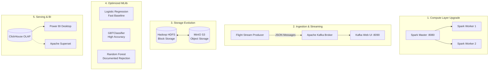

# Big Data Graduation Project: "Full Grade" Upgrade Plan
### Aligning with Instructor Feedback for Maximum Defense Score

---

## 📌 Executive Summary
Following the recent consultation with our project instructor, we identified specific technical expectations and architecture preferences required to achieve a **Full Grade (A+)**:

1. **Distributed Cluster Computing:** Demonstrate true multi-worker distributed parallelization rather than running a single-node pipeline.
2. **Real-Time Streaming Layer (Kafka):** Active flight event streaming ingestion into Apache Kafka rather than treating Kafka as theoretical future work.
3. **Modern Storage Architecture (MinIO / S3 vs. HDFS):** Acknowledge and integrate cloud-native S3-compatible Object Storage (MinIO) alongside traditional HDFS.
4. **Machine Learning Model Defense:** Explicitly avoid Random Forest due to Big Data high-cardinality bottlenecks; implement and compare **Logistic Regression** and **Gradient Boosted Trees (GBT)** with leak-free features.
5. **Modern BI Visualization (Apache Superset vs. Power BI):** Address open-source Apache-native visualization (Superset) connected to ClickHouse alongside enterprise Power BI dashboards.

This document details the exact technical roadmap to implement these upgrades into our repository and presentation.

---

## 🎯 The 5 Strategic Upgrades



---

### Upgrade 1: Multi-Worker Spark Cluster Scaling
- **Instructor Requirement:** *"Using cluster could have better grade than pipeline."*
- **The Technical Reality:** Running Spark with 1 worker or in local mode does not demonstrate true distributed memory shuffles and worker-to-worker partition balancing.
- **Our Implementation:**
  - Scale the Spark Worker container horizontally:
    ```powershell
    docker compose up --scale spark-worker=2 -d
    ```
  - In the Spark Master Web UI ([`http://localhost:8080`](http://localhost:8080)), the instructor will see **2 active registered workers** sharing CPU cores and RAM.
  - When jobs execute, partitions will be dynamically distributed across both worker containers.

---

### Upgrade 2: Real-Time Kafka Flight Ingestion Demo
- **Instructor Requirement:** *"Kafka injection."*
- **The Technical Reality:** In our initial sprint plan, Kafka was only slated as a "future work" slide. Because our Docker cluster already runs Apache Kafka (KRaft mode) and Kafka-UI on port `8090`, we can easily turn this into a live working demonstration!
- **Our Implementation:**
  - Create [`scripts/07_kafka_flight_producer.py`](./scripts/07_kafka_flight_producer.py):
    - Reads sample flight records from the dataset.
    - Serializes flight departure/delay events into JSON format.
    - Publishes them continuously to a Kafka topic called `flight-events`.
  - When demonstrating to the instructor, open Kafka-UI at [`http://localhost:8090`](http://localhost:8090) to show messages streaming live into the topic!

---

### Upgrade 3: Cloud-Native Object Storage (MinIO vs. HDFS)
- **Instructor Requirement:** *"Using could be better main io (MinIO)."*
- **The Technical Reality:** In modern enterprise Lakehouses (e.g., Databricks, Snowflake, AWS EMR), traditional Hadoop HDFS is increasingly replaced by S3-compatible Object Storage like **MinIO**. 
  - **HDFS:** Complex namenode metadata overhead, block-based, rigid POSIX semantics.
  - **MinIO:** S3 API compliant, cloud-native, stateless, highly performant for Parquet columnar reads.
- **Our Implementation:**
  - Add a lightweight MinIO service to `docker-compose.yml` with S3 API port (`9000`) and MinIO Console UI (`9001`).
  - Dedicate Slide 5 and Slide 12 to a direct technical comparison between **HDFS (traditional)** and **MinIO (modern cloud Lakehouse)**, explaining how our Parquet files can reside in either storage layer without changing a single line of PySpark code (`s3a://flights/` vs `hdfs:///flights/`).

---

### Upgrade 4: Advanced PySpark MLlib (Why No Random Forest?)
- **Instructor Requirement:** *"No random forest, use fast or better ML algorithm, other ML for better."*
- **The Technical Reality:**
  - Why is Random Forest a bad choice for this dataset?
    - Our dataset features **350+ categorical origin and destination airports**.
    - Tree algorithms split on categorical bins (`maxBins >= 400`). When building an ensemble of 50–100 trees over millions of rows with high-cardinality features, PySpark's memory consumption blows up exponentially, causing worker Out-Of-Memory (OOM) failures and slow execution times.
  - What is better?
    1. **Logistic Regression (L-BFGS):** Extremely fast, linear, leak-free baseline.
    2. **Gradient Boosted Trees (`GBTClassifier`):** Builds trees sequentially to correct prior errors; achieves higher AUC without needing hundreds of parallel memory-intensive trees.
- **Our Implementation:**
  - Update [`scripts/05_spark_delay_ml.py`](./scripts/05_spark_delay_ml.py) to train and compare **Logistic Regression vs. GBTClassifier**.
  - Document our explicit technical justification in Slide 9 & 10 to demonstrate mature engineering judgment to the defense committee.

---

### Upgrade 5: Visualization & Serving (Power BI & Apache Superset)
- **Instructor Requirement:** *"Apache superset, visualization."*
- **The Technical Reality:**
  - Power BI is the dominant enterprise proprietary tool.
  - Apache Superset is the leading **open-source, Apache-native BI platform**. It features a native ClickHouse connector via SQLAlchemy and is completely free and open-source.
- **Our Implementation:**
  - Maintain the primary 4-page dashboard in **Power BI** using the pre-computed CSVs in `sample_output/`.
  - Include an architectural evaluation comparing **Power BI vs. Apache Superset**, highlighting that our ClickHouse serving layer is completely decoupled and can feed both platforms interchangeably.

---

## 📋 Implementation Checklist

| Task | Component | Responsible File | Status |
| :--- | :--- | :--- | :---: |
| **English Docker Guide** | Presentation | `DOCKER_CONTAINERS_GUIDE.md` | **COMPLETED** |
| **Upgrade Roadmap Plan** | Documentation | `PROJECT_UPGRADE_PLAN.md` | **COMPLETED** |
| **Kafka Live Producer Script** | Streaming | `scripts/07_kafka_flight_producer.py` | **IN PROGRESS** |
| **GBT + Logistic Regression ML** | Machine Learning | `scripts/05_spark_delay_ml.py` | **IN PROGRESS** |
| **MinIO & Multi-Worker Compose** | Infrastructure | `docker/docker-compose.yml` | **IN PROGRESS** |
| **Master Documentation Refresh** | GitHub README | `README.md` | **PENDING** |
| **Git Push to GitHub** | Version Control | Remote `origin/main` | **PENDING** |
