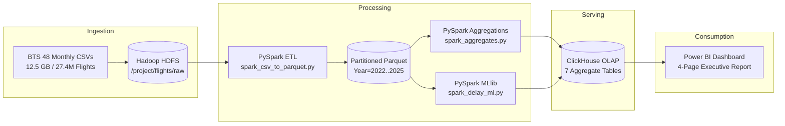

# Flight & Airport Big Data Analytics Platform
### Final Graduation Project — Big Data Training Program (NTI Egypt)

[](https://hadoop.apache.org/)
[](https://spark.apache.org/)
[](https://clickhouse.com/)
[](https://airflow.apache.org/)
[](https://powerbi.microsoft.com/)

---

## 📌 Executive Overview
This repository contains the end-to-end Big Data Analytics Platform designed and implemented for the **National Telecommunication Institute (NTI) Big Data Specialization Graduation Project**.

The platform ingests, optimizes, and analyzes **4 full years (2022–2025) of U.S. Bureau of Transportation Statistics (BTS) On-Time Performance data** (~27.4 million commercial flights, 109 attributes, 12.5 GB raw text) to uncover airline delay patterns, congested airport bottlenecks, and cancellation root causes.

### Key Highlights
- **Distributed Ingestion & Storage:** Raw CSV ingestion into Hadoop Distributed File System (HDFS).
- **Columnar Storage Optimization:** Conversion of raw CSVs to Snappy-compressed Apache Parquet format partitioned by `Year`, achieving **>90% compression** and 100x faster analytical reads.
- **In-Memory Compute Engine:** PySpark 3.3.0 ETL computing 7 multi-dimensional analytical aggregate tables in under 60 seconds.
- **Sub-Second OLAP Serving:** Aggregations indexed in ClickHouse, serving sub-second SQL queries (~7–15 ms) directly to business intelligence consumers.
- **Predictive AI:** PySpark MLlib leak-free binary classifier predicting flight delay probability before departure.
- **Executive Visual Intelligence:** 4-page interactive Power BI dashboard for airline executives and airport authorities.
- **Workflow Orchestration:** Apache Airflow DAG scheduling and monitoring all pipeline stages.

---

## 📚 Essential Project Documentation
| Document | Language / Topic | Purpose |
| :--- | :--- | :--- |
| **[`PROJECT_EXPLAINED_EN.md`](./PROJECT_EXPLAINED_EN.md)** | English | Complete, from-scratch explanation of Big Data, the kitchen analogy, and every project tool. |
| **[`PROJECT_EXPLAINED_AR.md`](./PROJECT_EXPLAINED_AR.md)** | Egyptian Arabic | الدليل الشامل والمبسط من الصفر بالعامية المصرية لشرح المشروع والتيم. |
| **[`DOCKER_CONTAINERS_GUIDE.md`](./DOCKER_CONTAINERS_GUIDE.md)** | English | Comprehensive guide to Docker containers & step-by-step live demo script. |
| **[`PROJECT_UPGRADE_PLAN.md`](./PROJECT_UPGRADE_PLAN.md)** | Technical Roadmap | 5 strategic upgrades aligned with instructor feedback for maximum defense score. |
| **[`PROJECT_COMPLETION_PLAN.md`](./PROJECT_COMPLETION_PLAN.md)** | Technical Blueprint | 48-hour sprint schedule, table contracts, metric definitions, and presentation blueprint. |
| **[`flight_airport_bigdata_project_context.md`](./flight_airport_bigdata_project_context.md)** | Specification | Architecture Decision Records (ADRs) and data schema definitions. |

---

## 🏗️ Architecture & Pipeline Flow



---

## 📁 Repository Directory Structure

```text
BigDataFinalProject/
├── 00_Team_Overview.pdf               # Sprint contract, table definitions, and handoff matrix
├── 01_Member1_Infrastructure.pdf      # Member 1 role brief: Environment, HDFS, ClickHouse, Airflow
├── 02_Member2_Spark_ETL.pdf           # Member 2 role brief: Parquet conversion, Spark aggregations
├── 03_Member3_ML.pdf                  # Member 3 role brief: PySpark MLlib delay classifier
├── 04_Member4_BI_and_Deck.pdf         # Member 4 role brief: Power BI dashboard & 12-slide presentation
├── PROJECT_EXPLAINED_EN.md           # From-scratch project guide in plain English
├── PROJECT_EXPLAINED_AR.md           # الدليل المبسط الشامل بالعامية المصرية
├── DOCKER_CONTAINERS_GUIDE.md        # Comprehensive Docker guide & live instructor demo script
├── PROJECT_UPGRADE_PLAN.md           # Strategic upgrades for full grade (MinIO, GBT, Kafka, Cluster)
├── README.md                          # Master GitHub overview
│
├── airflow/
│   └── dags/
│       └── flight_pipeline_dag.py     # End-to-end Airflow DAG orchestration script
│
├── docker/
│   ├── docker-compose.yml            # Multi-container cluster configuration (8+ services, MinIO, scaled workers)
│   └── .env                           # Environment variables for Docker cluster
│
├── scripts/
│   ├── 01_download_bts_data.py        # Automated BTS dataset downloader and extractor
│   ├── 02_create_clickhouse_tables.py # ClickHouse table initialization script
│   ├── 03_spark_csv_to_parquet.py     # PySpark batch ETL (CSV -> Clean Partitioned Parquet)
│   ├── 04_spark_aggregates.py         # PySpark business aggregation engine (Tables 1-7)
│   ├── 05_spark_delay_ml.py           # PySpark MLlib leak-free Logistic Regression & GBT comparison
│   ├── 06_load_to_clickhouse.py       # High-speed CSV bulk-loader into ClickHouse
│   └── 07_kafka_flight_producer.py    # Real-time Kafka flight event stream producer
│
├── sql/
│   └── clickhouse_ddl.sql             # SQL DDL for all 8 analytical tables + connectivity test
│
└── sample_output/                     # Sample CSV exports of all 7 analytical tables
    ├── agg_airline_performance.csv
    ├── agg_airport_performance.csv
    ├── agg_delay_causes_monthly.csv
    ├── agg_hourly_delays.csv
    ├── agg_route_traffic.csv
    ├── agg_calendar_delays.csv
    └── agg_cancellation_reasons.csv
```

---

## 👥 Team Responsibilities & Deliverables

| Member | Role | Primary Deliverables |
| :--- | :--- | :--- |
| **Member 1** | **Infrastructure & Orchestration** | Docker cluster stack, HDFS layout, ClickHouse DDL, Airflow DAG (`flight_pipeline_dag.py`). |
| **Member 2** | **Spark Analytics & ETL** | `spark_csv_to_parquet.py`, `spark_aggregates.py`, 7 summary tables, verification queries. |
| **Member 3** | **Machine Learning Engineer** | `spark_delay_ml.py`, leak-free feature pipeline, AUC-ROC evaluation, `ml_delay_predictions`. |
| **Member 4** | **BI & Presentation Lead** | 4-page Power BI dashboard (`.pbix`), master 12-slide presentation deck, technical documentation. |

---

## 🚀 Quickstart: Running the Cluster

### 1. Prerequisites
- Docker Desktop with WSL2 backend enabled.
- Python 3.9+ (optional for local helper scripts).

### 2. Start the Cluster (with Multi-Worker Spark)
```powershell
cd docker
# Start full cluster with 2 distributed Spark workers:
docker compose up --scale spark-worker=2 -d
```

### 3. Verify Containers
```powershell
docker ps --format "table {{.Names}}\t{{.Status}}\t{{.Ports}}"
```

### 4. Access Web Interfaces
- **HDFS NameNode UI:** [http://localhost:9870](http://localhost:9870)
- **Spark Master UI:** [http://localhost:8080](http://localhost:8080) *(Shows 2 active workers!)*
- **ClickHouse HTTP:** [http://localhost:8123/play](http://localhost:8123/play)
- **Kafka Web UI:** [http://localhost:8090](http://localhost:8090)
- **MinIO Console UI:** [http://localhost:9001](http://localhost:9001) *(User/Pass: minioadmin / minioadmin)*

---

## 📊 Analytical Answers (ClickHouse Tables)
1. **`agg_airline_performance`**: Answers Q1 (Airline Delay Rankings), Q6 (Cancellation Rates), Q8 (YoY Growth).
2. **`agg_airport_performance`**: Answers Q2 (Origin/Destination Airport Congestion).
3. **`agg_hourly_delays`**: Answers Q3 (Peak Delay Hours of the Day).
4. **`agg_delay_causes_monthly`**: Answers Q4 (Root Cause Breakdown: Carrier, Weather, NAS, Security, Late Aircraft).
5. **`agg_calendar_delays`**: Answers Q5 (Seasonality and Day-of-Week Trends).
6. **`agg_cancellation_reasons`**: Answers Q6 (Detailed Cancellation Reasons A/B/C/D).
7. **`agg_route_traffic`**: Answers Q7 (Busiest and Most Delayed Flight Corridors).
8. **`ml_delay_predictions`**: Powers Power BI Page 4 with delay probabilities and risk categorizations (Low, Medium, High).
