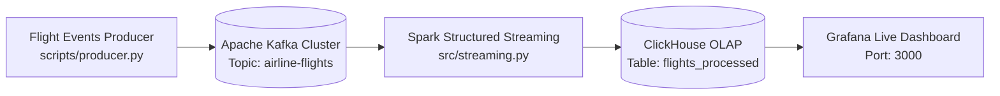

# Real-Time Streaming Speed Layer
## Flight & Airport Big Data Analytics Platform
### Technologies: Apache Kafka (KRaft), Spark Structured Streaming, ClickHouse, Grafana

---

## 📌 Architecture Overview



This folder implements the **Speed Layer** of our platform's **Lambda Architecture**:
1. **Producer (`scripts/producer.py`):** Ingests raw flight records and publishes live JSON event streams into the Kafka topic `airline-flights`.
2. **Message Broker (Kafka KRaft Cluster):** Handles high-throughput distributed event streaming without ZooKeeper dependency.
3. **Stream Processor (`src/streaming.py`):** PySpark Structured Streaming job consuming events from Kafka in micro-batches, performing feature engineering (`DepartureHour`, `IsDelayed`, `Route`), and writing directly to ClickHouse via JDBC sink.
4. **Live Visualization (`dashboards/airline_realtime_dashboard_grafana.json`):** Real-time monitoring dashboard in Grafana showing incoming flight throughput, delay rates by hour, and cancellation percentages.

---

## 🚀 Running the Streaming Layer

### 1. Start the Streaming Infrastructure
```powershell
docker compose -f streaming/docker/docker-compose-streaming.yml up -d
```

### 2. Initialize ClickHouse Tables
```powershell
python streaming/scripts/clickhouse_setup.py
```

### 3. Start the Kafka Producer
```powershell
python streaming/scripts/producer.py
```

### 4. Run Spark Structured Streaming
```powershell
spark-submit --packages org.apache.spark:spark-sql-kafka-0-10_2.12:3.3.0,com.clickhouse:clickhouse-jdbc:0.4.6 streaming/src/streaming.py
```

### 5. Access Grafana Dashboard
- Open [http://localhost:3000](http://localhost:3000) (Default user: `admin` / pass: `admin`).
- Import `streaming/dashboards/airline_realtime_dashboard_grafana.json`.
